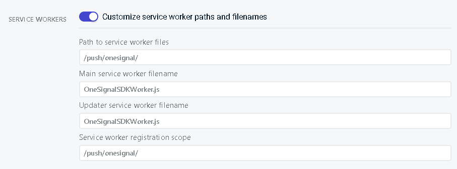

# **Technical Documentation**

This document outlines the steps required to set up the infrastructure for MatchUp. The application is a Next.js React-based Progressive Web App (PWA) hosted on Vercel, with various integrations and services. The setup leverages Supabase for backend services, OneSignal for push notifications, Mapbox for geodata, and Google for Single Sign-On (SSO). An architecture diagram is available in `./documentation/architekturdiagram.png` for reference.

## **Prerequisites**

To set up the infrastructure, ensure you have the following accounts:

* Supabase account  
* Vercel account  
* Github repository  
* Google Cloud account  
* OneSignal account  
* Mapbox account  
* Docker installed

# **Setting Up Mapbox**

1. Log in to [Mapbox](https://mapbox.com/) with your account.  
2. Generate a public access token in your Mapbox account settings.  
3. Add the token to your `.env` file under the variable:  
    NEXT\_PUBLIC\_MAPBOX\_ACCESS\_TOKEN=\<your-mapbox-access-token\>

# **Setting Up OneSignal**

1. Log in to [OneSignal](https://onesignal.com/) with your account.
2. Create a new Project for Web in OneSignal. 
   1. Set the site Name and site url you want to use. 
   2. In Advanced Push Settings set the following:
   
3. Copy the App ID and REST API Key from the OneSignal Settings -> Keys & IDs.  
4. Add the key to your `.env` file under the variable:  
    NEXT\_PUBLIC\_ONESIGNAL\_APP\_ID=\<your-onesignal-app-id\>  
   NEXT\_PUBLIC\_ONESIGNAL\_REST\_API\_KEY=\<your-onesignal-rest-api-key\>

# **Setting up Supabase**

## **Database Setup Instructions**

To set up the entire database environment:

1. Open the SQL editor in Supabase (or any preferred SQL interface).

2. Execute the ./setup/`create_schema.sql` file to create all the required tables, triggers, policies, and extensions for the application.

Hint: All the tables and their functionalities are described in ./documentation/database.md

## **Storage Setup Instructions**

1. Navigate to the [Supabase Dashboard](https://supabase.com/).  
2. In the project menu, navigate to **Storage**.  
3. Create 2 new public buckets named: 
   * `profile_pictures`  
   * `match_images`  
4. Click on the match\_images bucket and upload pictures. The images are inside the Github repository inside the setup/sport\_images folder  
5. The last step is to copy the bucket\_policies.sql content and execute it inside the Supabase SQL Editor

## **Edge Functions for Push Notification Setup Instructions**

***Note:***  
This step is only required for setting up Push Notification, it is optional and can be skipped

### Step 1: Login into Supabase via CLI

1. Navigate to your project root in the terminal.  
2. Log in to Supabase using the following command:  
   `npx supabase login`  
3. If prompted, install the required packages.

### Step 2: Set Environment Variables

1. Set the required environment variables for OneSignal:  
   `npx supabase secrets set ONESIGNAL_APP_ID=<YOUR_APP_ID>`  
   `npx supabase secrets set ONESIGNAL_REST_API_KEY=<YOUR_API_KEY>`  
2. Verify the secrets have been set correctly:  
   `npx supabase secrets list`

### Step 3: Initialize the Supabase Configuration

1. Run the following command to generate the Supabase configuration file  
   `npx supabase init`

### Step 4: Deploy the Functions

1. Ensure that **Docker** is installed and running on your machine.  
2. Deploy your Supabase Edge Functions using:  
   `npx supabase functions deploy`  
3. This will build and push the functions to production.  
4. You can inspect them in the **Supabase Dashboard** under **Edge Functions**.

### Step 5: Register Webhooks

1. Navigate to Dashboard **→** Database **→** Webhooks.  
2. Press **Enable Webhook,** this will create a new Webhooks tab next to Overview.  
3. Create a new webhook for each edge function:  
   * For **`notify`**: Set **Table** to `events`, trigger on **Insert**, and use **POST** method.  
   * For **`notify_new_request`**: Set **Table** to `event_requests`, trigger on **Insert**, and use **POST** method.  
   * For **`notify_accept_deny`**: Set **Table** to `event_participants`, trigger on **Insert**, and use **POST** method.

## **Email Authentication Setup Instructions**

1. Navigate to the [Supabase Dashboard](https://supabase.com/).  
2. Select your project.  
3. On the sidebar go to Authentication \> Providers.  
4. Enable Email signup  
5. Configure the Redirect URLs to handle authentication callbacks:  
   * For local development: [http://localhost:3000/auth/callback](http://localhost:3000/auth/callback)  
   * For production: https://your_site_url/auth/callback

## **Google OAuth with Supabase Setup Instructions** 

### Prerequisites

* A Google Cloud account  
* Access to your Supabase project

### Step 1: Setup Google Cloud Project

1. Open Google Cloud Console:  
   * Visit the Google Cloud Console.  
   * Sign in with your Google account.  
2. Create a new project:  
   * Click on Select a Project \> New Project.  
   * Enter a name for your project and click Create.

### Step 2: Configure Google OAuth

1. Navigate to APIs & Services \> Google Auth Platform.  
2. Select “Branding”.  
3. Provide project information:  
   * Application Name  
   * Support Email  
   * Contact Information  
   * Domain: Use `<supabase_id>.supabase.co` (you can find your Supabase ID in the Project Settings of your Supabase dashboard).  
4. Go to Clients \> Create Client.  
5. Select Application Type: Web Application.  
6. Enter a Name for your application (e.g., "MatchUP").  
7. Add Authorized Redirect URIs:  
   * Navigate to your Project Settings in Supabase.  
   * Under API, find your Project URL.  
   * Append `/auth/v1/callback` to the URL, e.g.:  
      https://\<your-supabase-project\>.supabase.co/auth/v1/callback  
8. Copy Client ID and Client Secret:  
   * After creating the client, copy the Client ID and Client Secret. Keep them safe.

### Step 3: Configure Supabase

1. Open the [Supabase Dashboard](https://supabase.com/).  
2. Navigate to your project.  
3. Go to Authentication \> Provides.  
4. Enable the Google toggle.  
5. Enter the Client ID and Client Secret you created in Google Cloud.  
6. Save the changes.

### Testing

1. Test the integration by visiting the following URL in your browser:  
   https://\<your-supabase-project\>.supabase.co/auth/v1/authorize?provider=google  
   (Replace `<your-supabase-project>` accordingly.)  
2. After successful login, you will be redirected back to your application (e.g., `localhost`) with an access token.

If you encounter issues, verify the redirect URIs in the Google Cloud Console and the configuration in Supabase settings.

# **Setting Up Vercel Deployment**

Before proceeding, ensure owning a vercel account, a github repository and all environmental variables and api keys.

## **Step 1: Connect GitHub Repository to Vercel**

1. Log in to Vercel  
2. Import Project:  
   * Click on the “Add New…” button on your Vercel dashboard and select “Project”  
   * Select “Import Git Repository”  
   * Choose Github and authorize Vercel to access your repositories  
   * Select the repository containing the Next.js Match-Up project  
       
3. Configure Project Settings:  
   * Set the Framework Preset to Next.js  
   * Leave the Root Directory set as “./”  
       
4. Deploy  
   * Click “Deploy” to start the deployment process  
   * Vercel will start building and deploying the app and create a new deployment for each new commit in the master branch

## **Step 2: Configure Environment Variables in Vercel**

The app relies on several environment variables for integrations. Here’s how to set them up in Vercel:

1. Go to Project Settings:  
   * In the Vercel dashboard, navigate to the Match Up project  
   * Click on the “Settings” tab, located in the top right of tab-bar  
       
2. Navigate to Environment Variables  
   * In the sidedrawer, select "Environment Variables”  
       
3. There are 2 options to add the environment variables  
   * Option 1: Paste the env key and value, then click on “Add Another”. Repeat this for every env key  
   * Option 2: Click on “Import .env” and select the local file containing the environment variables for the match-up app.  
   * Ensure to have the following env keys:

     NEXT\_PUBLIC\_ONESIGNAL\_APP\_ID

     NEXT\_PUBLIC\_MAPBOX\_ACCESS\_TOKEN

     NEXT\_PUBLIC\_SITE\_URL

     SUPABASE\_SERVICE\_ROLE\_KEY

     NEXT\_PUBLIC\_SUPABASE\_ANON\_KEY

     NEXT\_PUBLIC\_SUPABASE\_URL

	

4. Redeploy the Vercel deployment  
   * After adding all the necessary variables, navigate to the “Deployments” tab in the top left of the tab-bar  
   * Select the most recent deployment and click on “Redeploy”
